# PCC Platform — Application Architecture

**Version:** 1.0
**Audience:** Solo developer reference
**Status:** Pre-implementation (Phase 1 complete, Phase 2 pending)

---

## Table of Contents

1. [System Overview](#1-system-overview)
2. [Architecture Layers](#2-architecture-layers)
3. [Data Layer](#3-data-layer)
4. [MCP Tool Servers](#4-mcp-tool-servers)
5. [Agent Layer](#5-agent-layer)
6. [Orchestration Layer](#6-orchestration-layer)
7. [API Gateway](#7-api-gateway)
8. [Infrastructure](#8-infrastructure)
9. [Observability](#9-observability)
10. [Security and Compliance](#10-security-and-compliance)
11. [Data Flow — End-to-End Patient Journey](#11-data-flow--end-to-end-patient-journey)
12. [Directory Structure](#12-directory-structure)
13. [Technology Stack](#13-technology-stack)
14. [Environment Configuration](#14-environment-configuration)

---

## 1. System Overview

The PCC Platform is a multi-agent AI system that manages patient care coordination from symptom intake through diagnosis, treatment planning, and post-discharge monitoring. Four specialised AI agents — each using a distinct RAG pattern — collaborate via a LangGraph orchestrator. A Human-in-the-Loop (HITL) mechanism gates all clinical decisions. MCP tool servers provide structured access to EHR, lab, pharmacy, and appointment data.

### Core Principle

**Retrieve → Reason → Reflect → Act → Await Human Approval.** No agent takes a clinically consequential action autonomously.

### High-Level Component Diagram

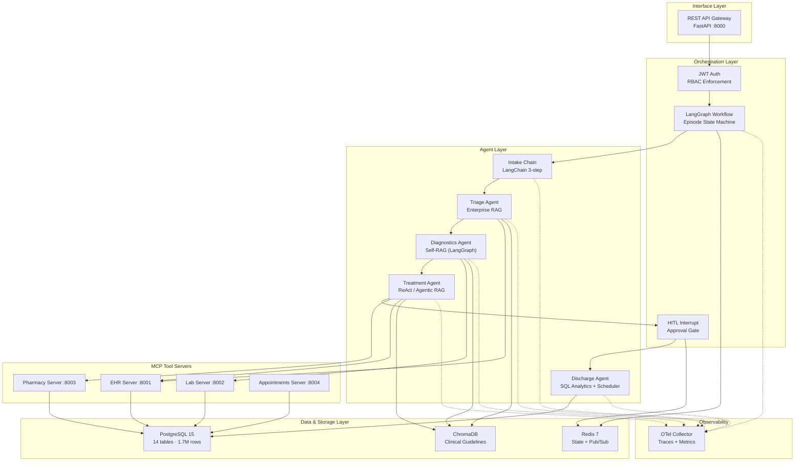

---

## 2. Architecture Layers

| Layer | Components | Purpose |
|---|---|---|
| **API Gateway** | FastAPI + JWT auth | Single entry point; RBAC enforcement |
| **Orchestration** | LangGraph workflow + HITL | Agent coordination, state management, approval gates |
| **Agent** | 4 agents + intake chain | Clinical reasoning using Enterprise RAG, Self-RAG, Agentic RAG, SQL Analytics |
| **MCP Tools** | 4 FastAPI servers | Structured data access for agents via typed REST endpoints |
| **Data** | PostgreSQL, Redis, ChromaDB | Relational data, workflow state, clinical guideline vectors |
| **Observability** | OTel Collector | Distributed traces, metrics, PHI-redacted audit trail |

---

## 3. Data Layer

### 3.1 PostgreSQL (port 5432)

14 tables housing 1.7M+ records across 573 patients.

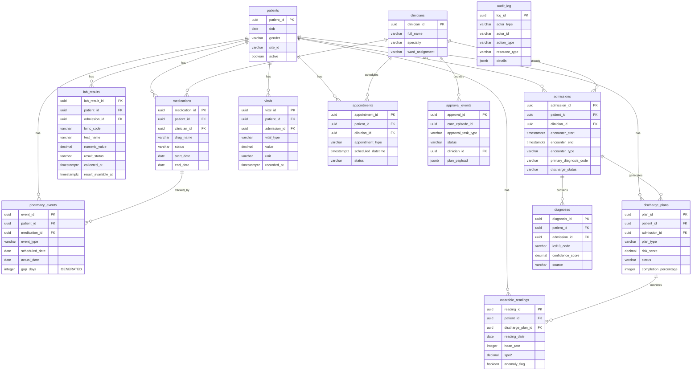

**Key design decisions:**
- All PKs are UUID (uuid_generate_v4)
- All timestamps are `TIMESTAMPTZ`
- `pharmacy_events.gap_days` is `GENERATED ALWAYS AS` (computed column)
- `wearable_readings` has 10% seeded anomalies (anomaly_flag) starting from day 18
- `approval_events.plan_payload` stores the full treatment plan as JSONB

### 3.2 Redis (port 6379)

| Use | Key Pattern | TTL |
|---|---|---|
| LangGraph workflow checkpoints | `episode:{task_id}` | None (persistent) |
| HITL notification pub/sub | channel: `hitl-notifications` | — |
| Pending approval state | `approval:{task_id}` | 72h |

### 3.3 ChromaDB (port 8200)

| Property | Value |
|---|---|
| Client | `PersistentClient` at `data/chromadb` |
| Collection | `clinical_guidelines` |
| Embedding model | `text-embedding-3-small` (1536 dimensions) |
| Chunk count | 14 chunks |
| Sources | NICE NG203 (Anaemia), NICE NG28 (Diabetes), WHO Anaemia Protocol |
| Chunk size | 600 tokens, 60 token overlap |

**Critical:** All queries must use OpenAI embeddings (not ChromaDB default). Use `query_embeddings=` parameter, not `query_texts=`.

---

## 4. MCP Tool Servers

All MCP servers are FastAPI apps sharing a common pattern: Pydantic models for request/response, SQLAlchemy queries, and JSON responses.

### MCP Server Overview

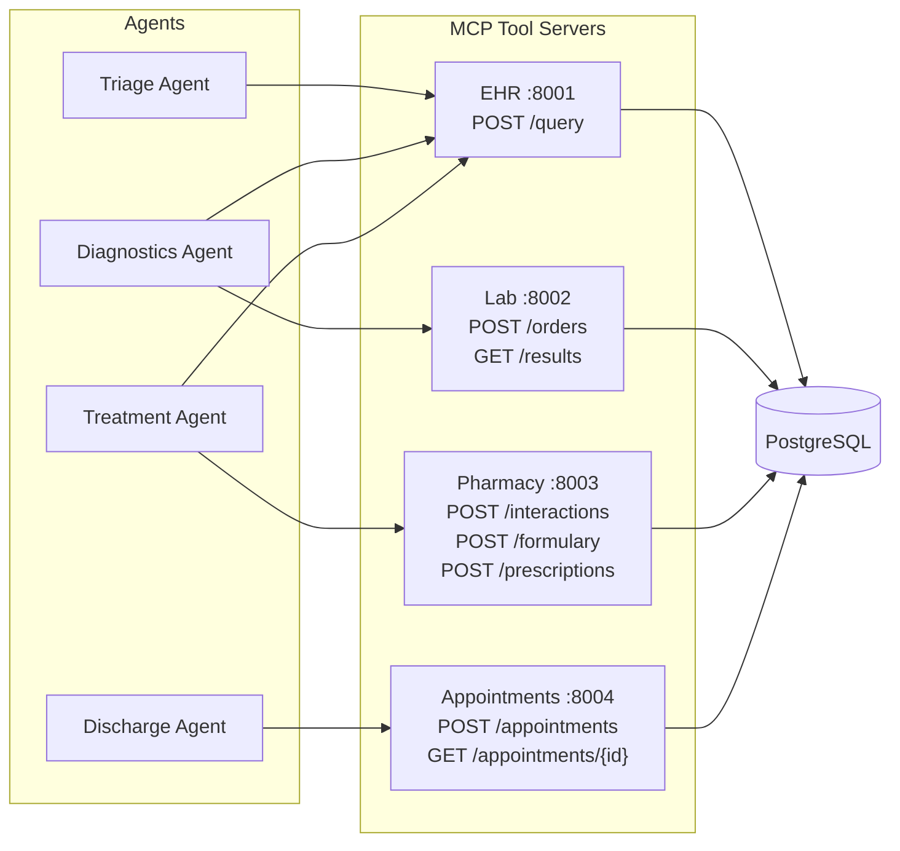

### 4.1 EHR MCP Server (port 8001)

| Endpoint | Method | Request | Response |
|---|---|---|---|
| `/query` | POST | `{patient_uuid, resource_types[]}` | Demographics, conditions, lab_results, medications, vitals, encounters |

resource_types: `demographics`, `conditions`, `lab_results`, `medications`, `vitals`, `encounters`

Error codes: 401 (auth), 404 (patient not found), 400 (invalid resource types)

### 4.2 Lab MCP Server (port 8002)

| Endpoint | Method | Request | Response |
|---|---|---|---|
| `/orders` | POST | `{patient_uuid, test_name, loinc_code}` | `{order_id, status: "pending", result_available_at}` |
| `/results` | GET | `?patient_id=&test_name=` | 202 if pending, 200 with values if ready |

`result_available_at` = now + 30 minutes (simulated delay).

### 4.3 Pharmacy MCP Server (port 8003)

| Endpoint | Method | Request | Response |
|---|---|---|---|
| `/interactions` | POST | `{drug_list[]}` | `{interactions[{drug_a, drug_b, severity}]}` |
| `/formulary` | POST | `{drug_name, site_id}` | `{available, formulations[]}` |
| `/prescriptions` | POST | `{patient_uuid, drug_name, dose, route, frequency}` | `{medication_id}` |

Pre-populated drug interaction and formulary reference tables.

### 4.4 Appointments MCP Server (port 8004)

| Endpoint | Method | Request | Response |
|---|---|---|---|
| `/appointments` | POST | `{patient_uuid, clinician_id, type, datetime}` | `{appointment_id, status: "scheduled"}` |
| `/appointments/{patient_id}` | GET | — | `{appointments[]}` |

---

## 5. Agent Layer

### Agent Pipeline

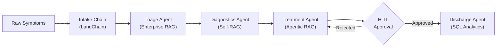

### 5.1 Intake Chain (LangChain)

A stateless 3-step chain — no tools, no state, no agent loop.

```
Step 1: Extraction    — Raw text → structured fields via GPT-4o
Step 2: Normalisation — Map symptoms to SNOMED-CT preferred terms (50-term lookup)
Step 3: Validation    — Schema enforcement, confidence scoring, one retry on failure
```

**Output schema — `ClinicalEntity`:**

```
ClinicalEntity:
  symptoms: [{name, duration_days, severity}]
  reported_negatives: [str]
  reported_medications: [{name, indication}]
  free_text_summary: str
  extraction_confidence: float
```

### 5.2 Triage Agent — Enterprise RAG

Receives `ClinicalEntity`, outputs urgency score + routing decision.

**Enterprise RAG fan-out:**

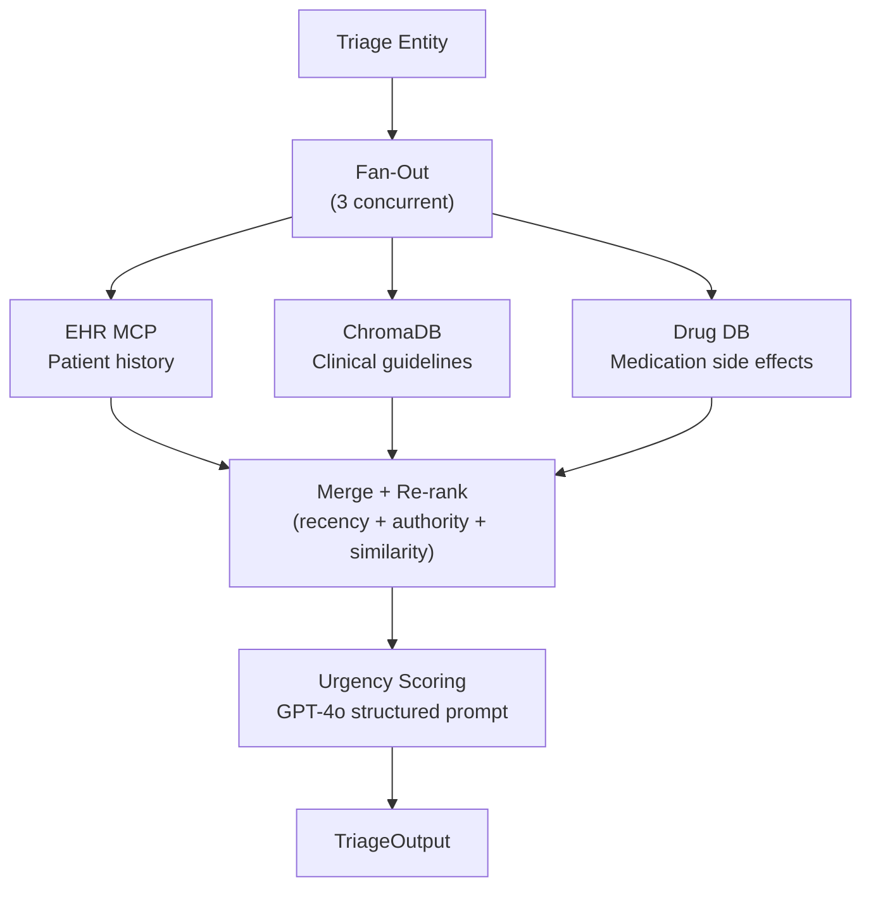

**Output schema — `TriageOutput`:**

```
TriageOutput:
  urgency_level: "emergency" | "urgent" | "routine" | "self-care"
  urgency_rationale: str
  retrieved_context: [doc]
  routing_decision: str
  triage_timestamp: datetime
```

Caution-preference: if any retrieved evidence suggests a potentially serious condition, urgency is elevated. Fallback on error: `"urgent"`.

### 5.3 Diagnostics Agent — Self-RAG (LangGraph Subgraph)

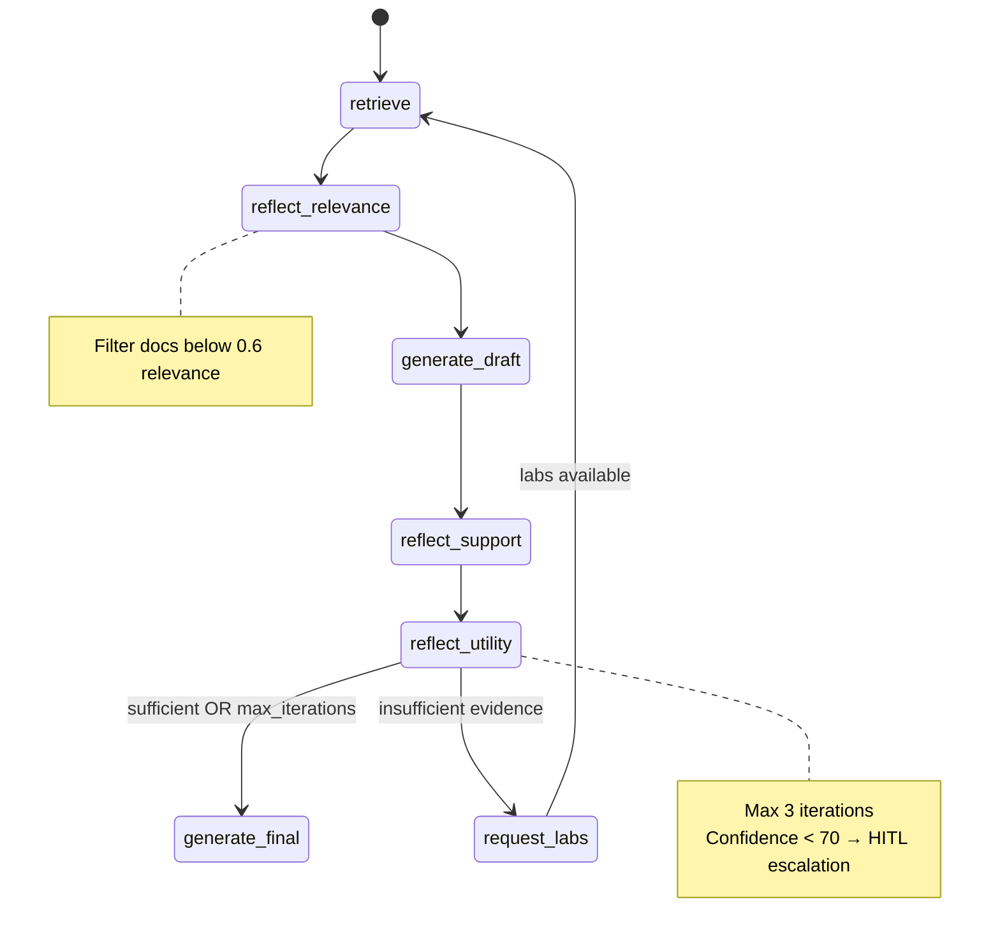

**State:**

```
DiagnosticsState:
  triage_packet: TriageOutput
  retrieved_docs: [doc]
  draft_hypothesis: str
  reflection_scores: {relevance, support, utility}
  iterations: int (max 3)
  lab_orders: [order]
```

**Confidence calculation:** `(mean_relevance × 0.8) + 20 if sufficient_evidence`

Lab waiting: checkpoint to Redis → background poll every 5 min → resume from `retrieve` node when results available.

**Output schema — `DiagnosticsOutput`:**

```
DiagnosticsOutput:
  primary_diagnosis: {icd10, name, confidence, citations[]}
  differential_diagnoses: [max 3]
  pending_lab_orders: [order]
  self_rag_iterations: int
  escalate_to_human: bool
  timestamp: datetime
```

### 5.4 Treatment Agent — Agentic RAG (ReAct Loop)

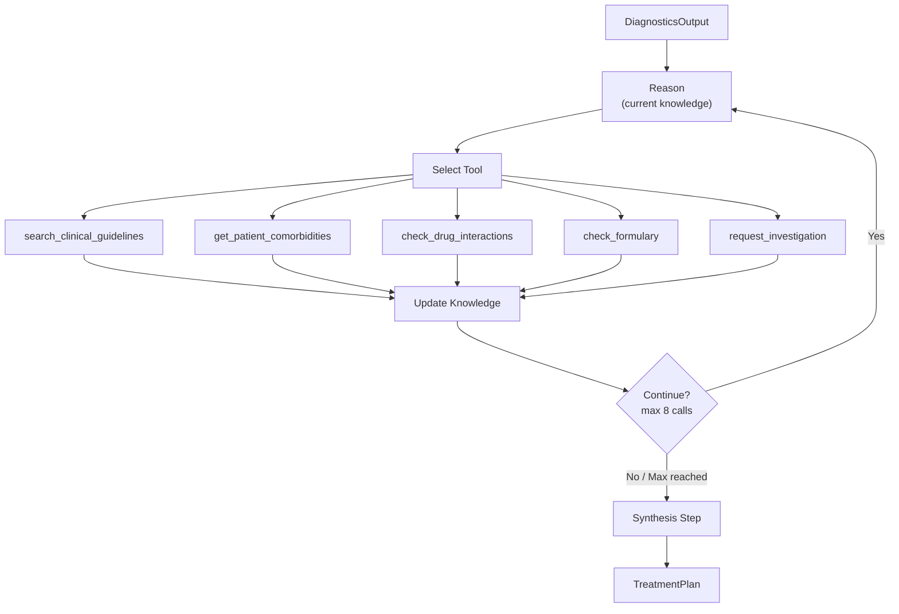

**5 available tools:**

| # | Tool | Source |
|---|---|---|
| 1 | `search_clinical_guidelines(query)` | ChromaDB — top 6 chunks |
| 2 | `get_patient_comorbidities(patient_uuid)` | EHR MCP |
| 3 | `check_drug_interactions(drug_list)` | Pharmacy MCP |
| 4 | `check_formulary(drug_name, site_id)` | Pharmacy MCP |
| 5 | `request_investigation(name)` | Records in state |

Max 8 tool calls. Force-exit at max with lower confidence flag.

**Key test scenario:** IDA + CKD → agent discovers CKD via tool 2 → pivots from oral iron to IV iron protocol.

**Output schema — `TreatmentPlan`:**

```
TreatmentPlan:
  primary_recommendation: {treatment, dose, route, frequency, duration, citation, rationale}
  contraindications_checked: [str]
  cause_investigation: [str]
  alternatives_rejected: [{name, reason}]
  monitoring_schedule: [item]
  confidence_score: float
  tool_call_count: int
  awaiting_human_approval: true
```

### 5.5 Post-Discharge Agent — SQL Analytics

Time-driven (APScheduler every 15 min), not event-driven.

**5 SQL analytics patterns:**

| # | Pattern | Purpose |
|---|---|---|
| 1 | Readmission risk cohort scoring | Historical 30-day readmission rate by diagnosis/demographics |
| 2 | Medication adherence drop-off | Gap between scheduled and actual refill > 3 days |
| 3 | Vital sign anomaly detection | Wearable readings vs patient's own 30-day baseline (stddev threshold) |
| 4 | Outcome KPI dashboard | 30/60/90-day readmission rates by ward, diagnosis, clinician |
| 5 | Population segmentation | Composite risk index for outreach prioritisation |

**Composite risk score:** `0.4 × cohort_rate + 0.3 × adherence_gap + 0.2 × anomaly_score + 0.1 × days_since_checkin`

Escalation threshold: **65** (configurable per plan_type). Escalate if score > 65 AND previous score ≤ 65.

Seeded anomaly patients should trigger detection by **Day 20–22**.

---

## 6. Orchestration Layer

### 6.1 LangGraph Workflow

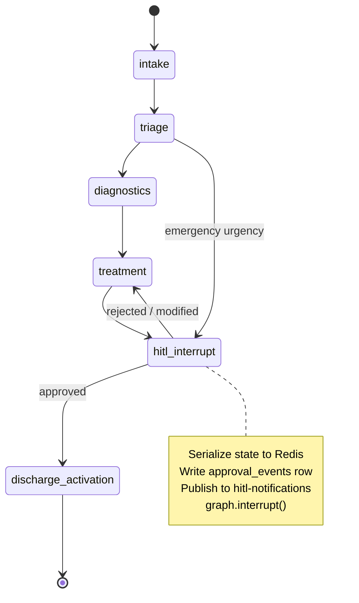

**Episode state:**

```
EpisodeState:
  patient_uuid: UUID
  episode_id: UUID
  intake_output: ClinicalEntity
  triage_output: TriageOutput
  diagnostics_output: DiagnosticsOutput
  treatment_plan: TreatmentPlan
  approval_status: "pending" | "approved" | "rejected" | "modified"
  discharge_plan_id: UUID | null
```

All state checkpointed to Redis. Workflow survives restarts.

### 6.2 HITL Mechanism

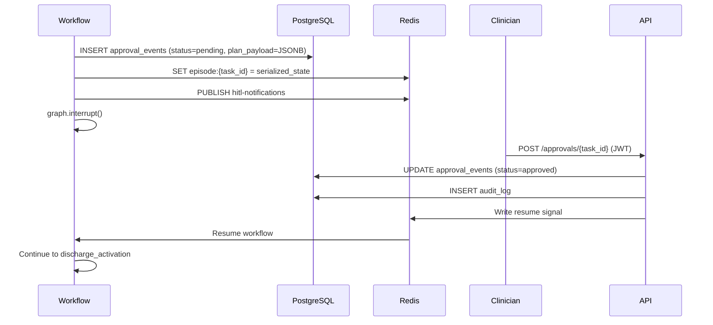

**Timeout escalation:**
- 24h pending → elevated notification
- 72h pending → escalate to department head

---

## 7. API Gateway

FastAPI orchestrator at port 8000.

### Endpoints

| Endpoint | Method | Auth | Description |
|---|---|---|---|
| `/api/v1/health` | GET | None | Service health check |
| `/api/v1/auth/token` | POST | Credentials | Issue JWT (8h expiry) |
| `/api/v1/symptoms` | POST | JWT | Trigger intake→triage, return triage_ref_id |
| `/api/v1/cases/{case_id}` | GET | JWT | Episode state |
| `/api/v1/approvals/pending` | GET | JWT | Pending approvals (ward-scoped) |
| `/api/v1/approvals/{task_id}` | POST | JWT | Approve/reject |
| `/api/v1/patients/{patient_id}/discharge-plan` | GET | JWT | Plan + risk score |
| `/api/v1/analytics/kpis` | GET | JWT (admin) | 30/60/90-day rates |

### JWT Token

```
Payload:
  sub: clinician_id
  role: "patient" | "nurse" | "physician" | "specialist" | "administrator"
  site_id: str
  ward: str
  exp: now + 8h
```

All 401/403 responses write to `audit_log`.

---

## 8. Infrastructure

### Docker Compose Topology

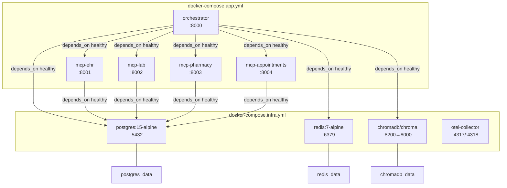

All services on `pcc-network` (bridge, external).

**Health checks:**
- PostgreSQL: `pg_isready`
- Redis: `redis-cli ping`
- ChromaDB: `curl heartbeat`
- App services: HTTP health endpoint

### Volumes

| Volume | Mount | Purpose |
|---|---|---|
| `postgres_data` | `/var/lib/postgresql/data` | Persistent database storage |
| `redis_data` | `/data` | AOF persistence |
| `chromadb_data` | `/chroma/chroma` | Vector store persistence |

---

## 9. Observability

### OpenTelemetry Architecture

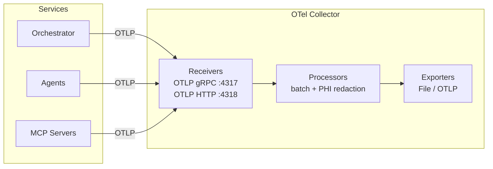

### Span Instrumentation Plan

| Component | Span Name | Attributes |
|---|---|---|
| Intake chain | `intake.extract`, `intake.normalise`, `intake.validate` | confidence, entity count |
| Triage agent | `triage.retrieve` (parent) + 3 children | source, doc_count, top_score |
| Diagnostics | `diagnostics.{node_name}` per Self-RAG node | iteration, reflection_result |
| Treatment | `treatment.react_iteration.{n}` | tool_name, input_summary |
| HITL | `hitl.submit`, `hitl.await`, `hitl.resume` | task_id, outcome |
| Discharge | `discharge.scheduler_run`, `discharge.query.{name}` | patient_count, duration_ms |
| MCP servers | `mcp.{server}.{endpoint}` | patient_id, status_code |

### PHI Redaction

OTel Collector config redacts: `patient_name`, `dob`, `free_text` → `[REDACTED]` before export. Traces reference `episode_id` and `patient_uuid` only.

### W3C Trace Context

All inter-service calls propagate `traceparent` / `tracestate` headers. A single root trace spans the entire patient episode.

---

## 10. Security and Compliance

### Authentication Flow

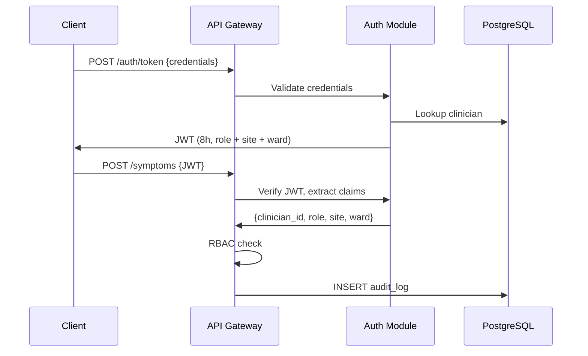

### RBAC Matrix

| Role | Own Records | Ward Patients | Referred Patients | KPIs | PHI Access |
|---|---|---|---|---|---|
| Patient | ✅ | — | — | — | Own only |
| Nurse | — | ✅ | — | — | Ward scope |
| Physician | — | ✅ | ✅ | — | Panel scope |
| Specialist | — | — | ✅ | — | Referral scope |
| Administrator | — | — | — | ✅ | Aggregate only |
| AI Agent (service) | — | — | — | — | Episode scope only |

### HIPAA Controls

| Requirement | Implementation |
|---|---|
| Access controls | JWT + RBAC at API gateway + RAG retrieval layer |
| Audit controls | Every API call → audit_log; full OTel trace per episode |
| Integrity | State store writes are append-only with version history |
| Transmission | All inter-service on Docker network; HTTPS for external |
| PHI minimisation | OTel exporter redacts PHI; traces use episode_id not names |

---

## 11. Data Flow — End-to-End Patient Journey

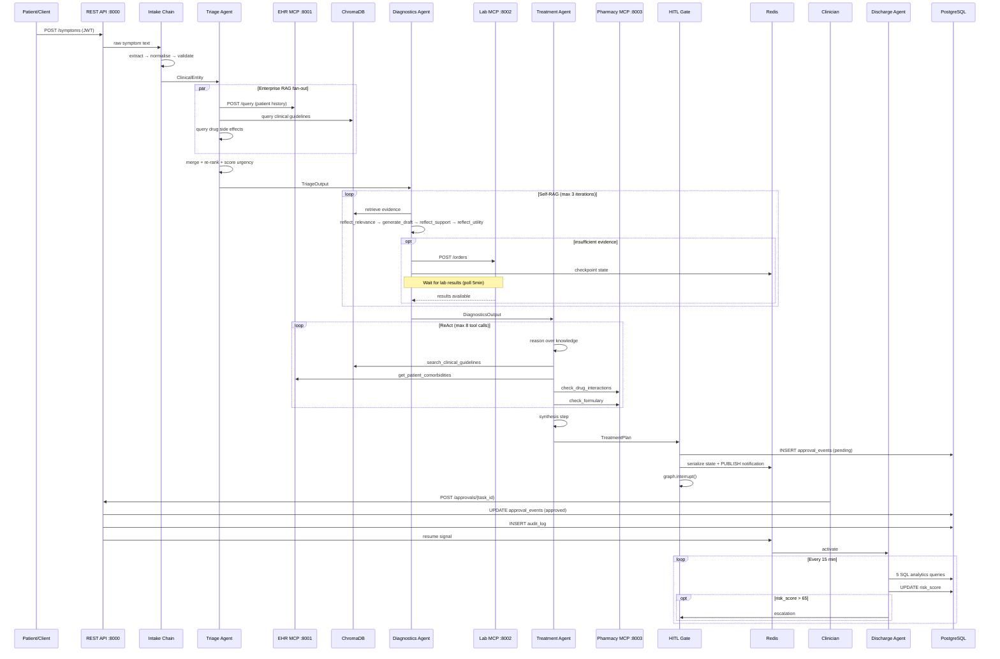

---

## 12. Directory Structure

```
pcc-platform/
├── agents/
│   ├── intake/
│   │   ├── __init__.py
│   │   ├── chain.py          # 3-step LangChain chain
│   │   └── schemas.py        # ClinicalEntity
│   ├── triage/
│   │   ├── __init__.py
│   │   ├── agent.py          # Enterprise RAG agent
│   │   ├── retrieval.py      # Fan-out + re-ranking
│   │   └── schemas.py        # TriageOutput
│   ├── diagnostics/
│   │   ├── __init__.py
│   │   ├── agent.py          # Self-RAG LangGraph subgraph
│   │   └── schemas.py        # DiagnosticsOutput
│   ├── treatment/
│   │   ├── __init__.py
│   │   ├── agent.py          # ReAct loop
│   │   ├── tools.py          # 5 tool definitions
│   │   └── schemas.py        # TreatmentPlan
│   └── discharge/
│       ├── __init__.py
│       ├── agent.py           # Risk scoring logic
│       ├── scheduler.py       # APScheduler 15min loop
│       ├── queries.py         # 5 SQL analytics patterns
│       └── schemas.py         # DischargeOutput
├── mcp_servers/
│   ├── ehr/
│   │   ├── main.py            # FastAPI app :8001
│   │   ├── models.py          # Pydantic schemas
│   │   └── queries.py         # PostgreSQL queries
│   ├── lab/
│   │   ├── main.py            # FastAPI app :8002
│   │   ├── models.py
│   │   └── queries.py
│   ├── pharmacy/
│   │   ├── main.py            # FastAPI app :8003
│   │   ├── models.py
│   │   └── queries.py
│   └── appointments/
│       ├── main.py            # FastAPI app :8004
│       ├── models.py
│       └── queries.py
├── orchestrator/
│   ├── __init__.py
│   ├── workflow.py            # LangGraph episode graph
│   ├── hitl.py                # HITL interrupt + approval
│   ├── api.py                 # FastAPI REST gateway
│   └── auth.py                # JWT issuance + validation
├── config/
│   ├── __init__.py
│   ├── settings.py            # Pydantic BaseSettings
│   ├── database.py            # SQLAlchemy engine + session
│   ├── redis_client.py        # Redis connection factory
│   ├── chromadb_client.py     # PersistentClient + query util
│   ├── telemetry.py           # OTel tracer setup
│   └── otel-collector-config.yaml
├── docker/
│   ├── Dockerfile.mcp         # Python 3.12 slim, uvicorn
│   └── Dockerfile.orchestrator
├── tests/
│   ├── unit/
│   │   ├── test_intake_chain.py    # 5 edge cases
│   │   └── test_triage_agent.py    # 10 urgency scenarios
│   └── integration/
│       ├── test_mcp_servers.py     # MCP endpoint tests
│       └── test_end_to_end.py      # Full patient journey
├── data/
│   ├── schemas/               # SQL DDL
│   ├── seeds/                 # Faker + transform scripts
│   ├── guidelines/            # Clinical guideline TXT files
│   └── chromadb/              # PersistentClient storage
├── vector_store/
│   ├── load_chromadb.py
│   └── verify_guidelines.py
├── docker-compose.infra.yml
├── docker-compose.app.yml
├── pyproject.toml
├── .env.example
└── .gitignore
```

---

## 13. Technology Stack

| Category | Technology | Version | Role |
|---|---|---|---|
| Language | Python | 3.12.10 | All application code |
| LLM | OpenAI GPT-4o | API | Clinical reasoning, extraction |
| Embeddings | text-embedding-3-small | 1536-dim | Vector store + retrieval |
| Chains | LangChain | 0.2.11 | Intake chain, RAG pipelines |
| Orchestration | LangGraph | 0.1.19 | Multi-agent workflow, Self-RAG subgraph |
| API | FastAPI | 0.111.1 | MCP servers + orchestrator gateway |
| Auth | PyJWT | 2.8.0 | JWT token issuance + validation |
| Database | PostgreSQL | 15 (alpine) | Relational data, audit trail |
| ORM | SQLAlchemy | 2.0.31 | Database access layer |
| Cache/State | Redis | 7 (alpine) | LangGraph checkpoints, pub/sub |
| Vector Store | ChromaDB | latest | Clinical guideline embeddings |
| Observability | OpenTelemetry SDK | 1.25.0 | Traces, metrics |
| Scheduler | APScheduler | — | Post-discharge agent loop |
| Server | uvicorn | 0.30.1 | ASGI server |
| Containers | Docker Compose | v2 | Local development stack |

---

## 14. Environment Configuration

All configuration via `.env` file (gitignored). Reference: `.env.example`.

| Variable | Default | Used By |
|---|---|---|
| `OPENAI_API_KEY` | — | All agents, intake chain |
| `POSTGRES_HOST` | `localhost` | MCP servers, discharge agent |
| `POSTGRES_PORT` | `5432` | MCP servers, discharge agent |
| `POSTGRES_DB` | `healthcare_platform` | All DB consumers |
| `POSTGRES_USER` | `healthcare_app` | All DB consumers |
| `POSTGRES_PASSWORD` | — | All DB consumers |
| `REDIS_HOST` | `localhost` | Orchestrator, HITL |
| `REDIS_PORT` | `6379` | Orchestrator, HITL |
| `CHROMADB_HOST` | `localhost` | Vector store queries |
| `CHROMADB_PORT` | `8200` | Vector store queries |
| `JWT_SECRET` | — | Auth module (64-char hex) |
| `ENVIRONMENT` | `development` | Logging, feature flags |
| `LOG_LEVEL` | `INFO` | All services |
| `EMBEDDING_MODEL` | `text-embedding-3-small` | ChromaDB loader + retrieval |
| `CHUNK_SIZE` | `600` | Vector store chunking |
| `CHUNK_OVERLAP` | `60` | Vector store chunking |

---

*Generated from project specifications. All schemas and contracts are pre-implementation targets.*
